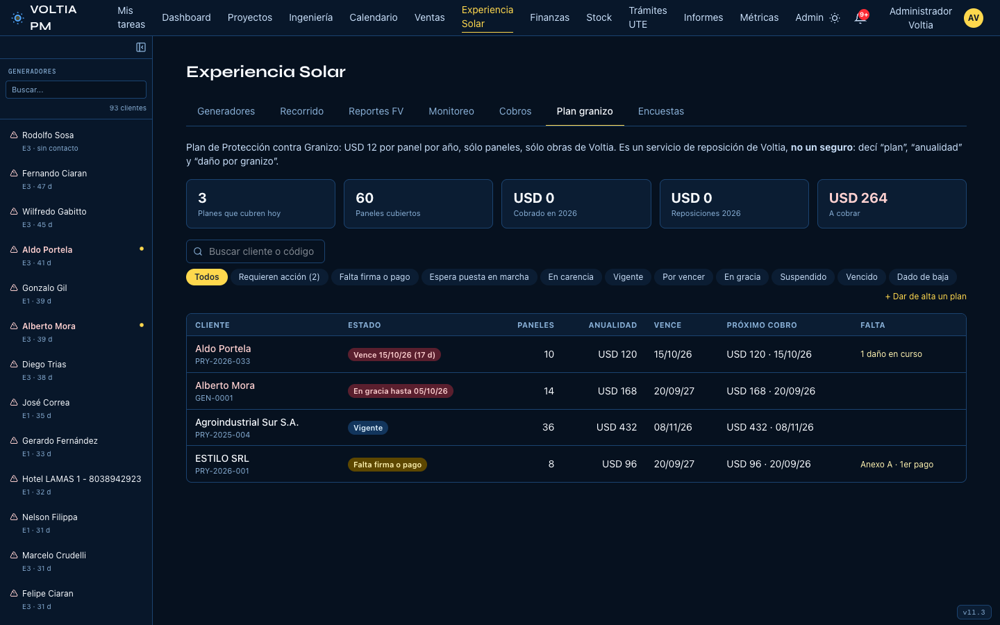
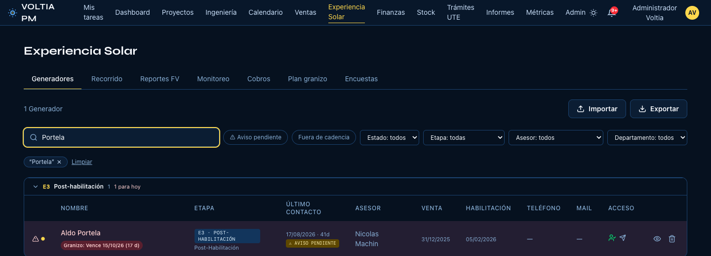
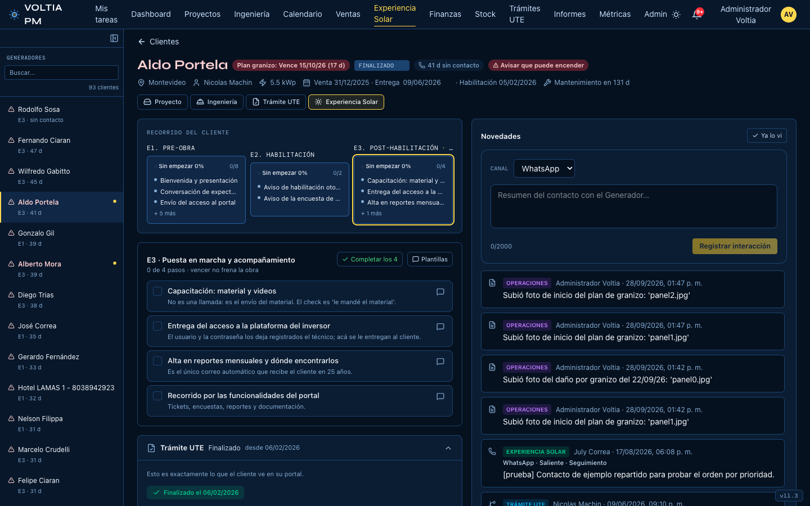
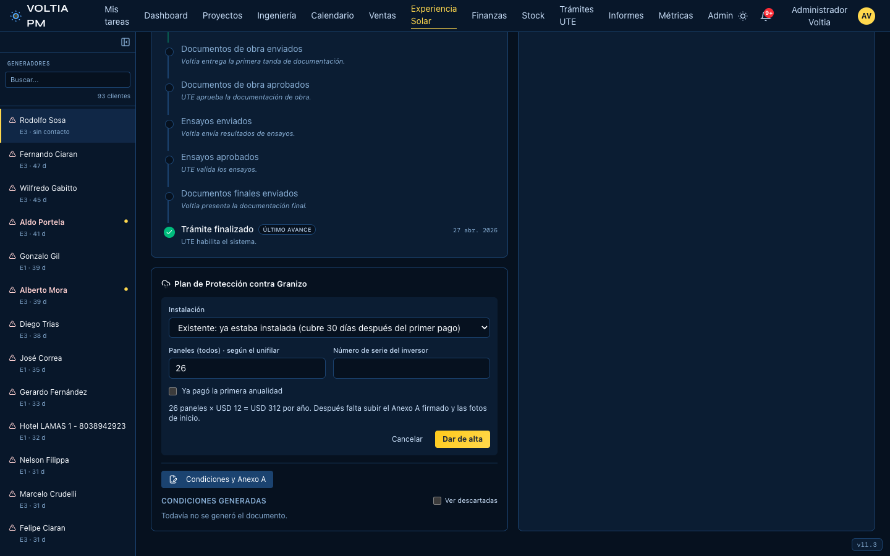
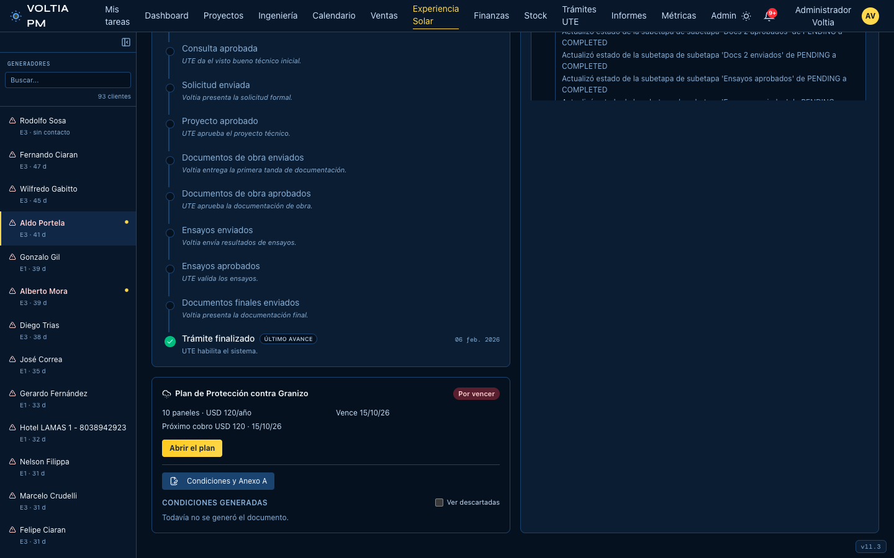
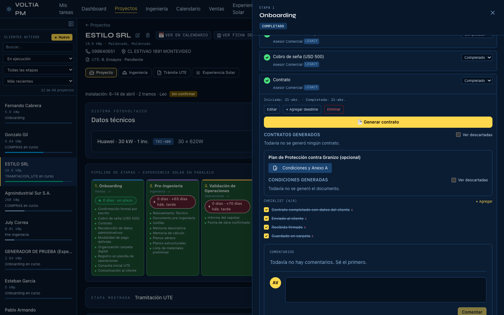
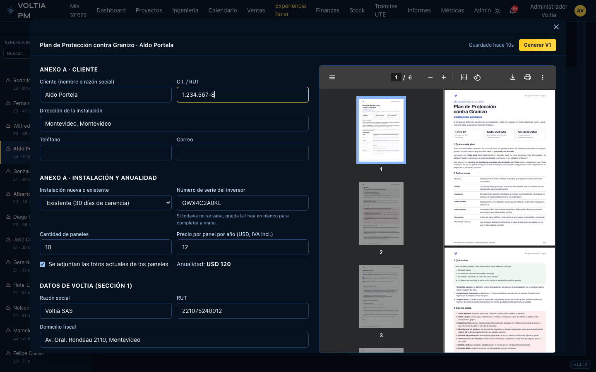
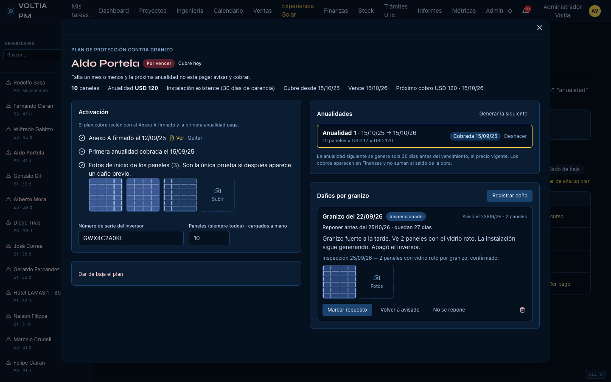
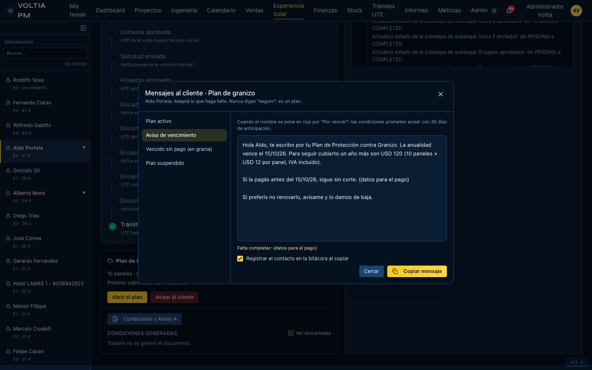

# Cómo se usa en Voltia PM

> Sección para agregar a la **Guía del equipo — Plan de granizo** (uso interno).
> Las capturas están en `capturas/`, con datos de prueba.
> Escrita el 28 de septiembre de 2026.

Todo el plan se maneja en Voltia PM. En pantalla se dice **plan**, **anualidad**
y **daño por granizo**, igual que con el cliente: nunca *seguro*, *póliza* ni
*siniestro*.

---

## 1. Dónde está

En **Experiencia Solar**, pestaña **Plan granizo**. Ahí están todos los clientes
con el plan: en qué estado está cada uno, cuándo vence, cuánto y cuándo se le
cobra, y qué le falta. Arriba vas a ver cuántos planes cubren hoy, cuánto se
cobró en el año, cuánto se gastó en reposiciones y cuánto queda por cobrar.

Primero aparecen los que requieren acción. El filtro **Requieren acción** los
deja solos.

**El nombre en rojo** quiere decir que ese cliente necesita que lo contactes
por el plan:

- le falta un mes o menos para vencer y la próxima anualidad no está paga;
- venció sin pago y está en los 15 días de gracia;
- quedó suspendido;
- se terminó el plan sin renovar.

El nombre en rojo aparece en la pestaña Plan granizo, en la lista de
Generadores, en la barra lateral y en la ficha del cliente, con una etiqueta que
dice qué pasa ("Vence 15/10/26 (17 d)", "En gracia", "Suspendido").

---

## 2. Dar de alta un plan

Se hace desde la **ficha del cliente**, en la tarjeta **Plan de Protección
contra Granizo**. Si estás en la pestaña Plan granizo, **+ Dar de alta un plan**
te lleva a buscar al cliente.

- **Instalación nueva:** se adhiere al contratar la obra. No tiene carencia y
  arranca sola el día de la puesta en marcha. Si todavía no está en marcha,
  dejás la fecha vacía.
- **Instalación existente:** ya estaba instalada. Cubre **30 días después del
  primer pago**. La anualidad se cuenta desde ahí.
- **Paneles:** vienen cargados del unifilar o de la propuesta, y te dice de
  dónde salieron. Tienen que ser **todos** los paneles de la instalación.
- **Número de serie del inversor:** identifica la instalación. Si se cambia el
  inversor, lo actualizás en el plan.
- **Ya pagó la primera anualidad:** marcalo sólo si el cliente ya había pagado
  antes de cargar el plan, y poné la fecha real del pago.

---

## 3. El documento para el cliente

Hay un solo PDF: las condiciones generales con el Anexo A ya completo con los
datos del cliente y el Anexo B en blanco. Se genera con **Condiciones y
Anexo A**:

- en la **ficha del cliente**, dentro de la tarjeta del plan;
- en el **Onboarding del proyecto**, en la subetapa **Contrato**, para
  ofrecerlo junto con la obra.

A la izquierda corregís lo que haga falta. A la derecha ves el PDF tal como le
va a llegar al cliente.

- Si falta un dato obligatorio (por ejemplo la C.I.), queda marcado en rojo y
  no te deja generarlo.
- Cada vez que lo generás queda guardado como una versión nueva. Desde la lista
  de versiones lo podés ver o descargar para mandarlo.
- **El texto de las condiciones no se edita**: es el aprobado. Sólo se editan
  los datos del Anexo A y los de Voltia.

---

## 4. Activar el plan

En la ficha, **Abrir el plan**. La parte **Activación** muestra lo que falta,
con un tilde por cada cosa:

1. **Anexo A firmado:** subís la hoja firmada (alcanza una foto o un escaneo) y
   la fecha de firma. **Sin esto el plan no cubre**, aunque el cliente haya
   pagado.
2. **Primera anualidad cobrada:** se marca en **Anualidades**.
3. **Fotos de inicio** (sólo instalaciones existentes): las que manda el
   cliente al adherirse. Son la única prueba si después aparece un daño previo.

---

## 5. Cobrar cada anualidad

En **Anualidades**, **Marcar cobrada** y ponés **la fecha real del pago**. Esa
fecha importa:

- En una instalación existente, fija cuándo termina la carencia y desde cuándo
  corren los 12 meses.
- En una renovación, si pagó dentro de los 15 días del vencimiento sigue
  cubierto sin corte. Si pagó después, corre una nueva carencia de 30 días.

El cobro aparece solo en **Finanzas**, en una línea propia, **Plan granizo**. No
suma al saldo de la obra.

**Renovación:** la anualidad siguiente se genera sola 30 días antes del
vencimiento, al precio vigente. Si hace falta antes, está **Generar la
siguiente**.

**Cómo te enterás:** cuando un plan está por vencer, venció sin pago o quedó
suspendido, o cuando un daño se pasó del plazo, te llega el aviso por la campana.
Si ya venció, además aparece en los pendientes del correo de la mañana.

**Al cliente le escribís vos**: Voltia PM no le manda nada solo. En la ficha, si
el plan está en rojo, aparece **Avisar al cliente** con el mensaje listo, con
fechas, monto y paneles ya puestos. Completás los datos para el pago y lo
copiás; el contacto queda registrado. En el plan (**Mensajes al cliente**) y en
cada daño (**Mensaje al cliente**) están los demás mensajes.

---

## 6. Qué quiere decir cada estado

| Estado | Qué pasa | Qué hacés |
|---|---|---|
| Espera puesta en marcha | Se adhirió con la obra y todavía no se puso en marcha | Nada: arranca solo |
| Falta firma o pago | No cubre | Conseguir el Anexo A firmado y el pago |
| En carencia | Pagó, pero cubre recién desde la fecha que muestra | Nada |
| Vigente | Cubre | Nada |
| **Por vencer** 🔴 | Falta un mes o menos y la próxima anualidad no está paga | Avisar y cobrar |
| **En gracia** 🔴 | Venció sin pago; sigue cubriendo hasta 15 días | Cobrar ya |
| **Suspendido** 🔴 | No cubre. Al pagar corre una nueva carencia | Cobrar y avisarle |
| **Vencido** 🔴 | Se terminó la última anualidad sin renovar | Renovar o dar de baja |
| Dado de baja | Cubre hasta el fin del período que ya pagó | Nada |

---

## 7. Cuando avisa un daño por granizo

En el plan, **Daños por granizo → Registrar daño**, el mismo día que avisa.
Cargás la fecha del granizo, la fecha en que avisó, cuántos paneles ve dañados,
lo que contó (el Anexo B) y las fotos. Si la tormenta pegó en muchas obras,
marcás **evento masivo** y el plazo de reposición pasa de 30 a 60 días.

Voltia PM te avisa si ese día **el plan no tenía cobertura** (sin firma, sin
pago, en carencia o suspendido) y si el aviso llegó **fuera de plazo** (más de 10
días hábiles).

Después vas avanzando el daño:

1. **Marcar inspeccionado:** la fecha de la inspección y lo que se vio.
2. **Marcar repuesto:** la fecha, cuántos paneles se repusieron y el costo real
   (panel, mano de obra, traslado). El costo va solo a Finanzas como gasto del
   plan. No deja reponer más paneles de los que tiene el plan en esa anualidad.
3. **No se repone:** elegís la causal. Cada causal ya cita la sección de las
   condiciones, que es lo que le decís al cliente.

Cada daño muestra **cuánto queda para inspeccionar o para reponer**, y se pone
en rojo si se pasó el plazo.

---

## 8. Ampliaciones

Si Voltia amplía una instalación que tiene el plan, en el plan aparece **Sumar
ampliación**. Los paneles nuevos cubren desde su puesta en marcha y Voltia PM
calcula el cobro proporcional a los meses que faltan hasta la próxima anualidad.
Desde ahí, las anualidades siguientes ya van con todos los paneles.

---

## 9. Baja

En el plan, **Dar de baja el plan**, con el motivo. La anualidad en curso no se
reintegra y el plan sigue cubriendo hasta el fin del período que ya pagó. Si
vuelve, **Reactivar el plan**: si ya se le había terminado la anualidad, arranca
como una instalación existente, con 30 días de carencia.

---

## Cambios en "Qué falta cerrar"

- ~~Integrar el cobro anual y el aviso de renovación a Voltia PM.~~ →
  **Hecho.** Voltia PM avisa al equipo y deja el mensaje al cliente listo para
  mandar.
